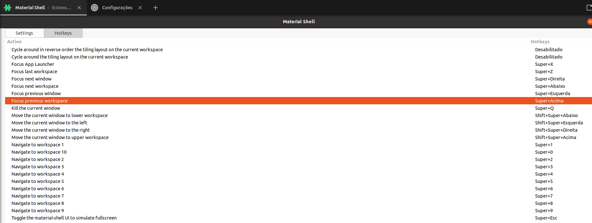

# Theming

## Gnome Terminal Dracula Theme

```text
git clone https://github.com/dracula/gnome-terminal ~/www/dracula/gnome-terminal
cd ~/www/dracula/gnome-terminal
./install.sh
```

## GTK themes

### Dracula

* Download and move the contents to **`/usr/share/themes`**

```text
wget https://github.com/dracula/gtk/archive/master.zip
unzip master.zip
mv gtk-master Dracula
mv Dracula /usr/share/themes/
```

* Activate theme
  * Press **`ALT + F2`**
  * Type: **`gnome-tweaks`**

## Gnome Shell Extensions

### Hot to show installed gnome shell extensions


Access this [**link**](https://extensions.gnome.org/local) or press "**F2**", type "**gnome-tweak**" and select the "**Extensions**" tab.


### Recommended Extensions

* \*\*\*\*[**Caffeine**](https://extensions.gnome.org/extension/517/caffeine/)\*\*\*\*
* \*\*\*\*[**Emoji Selector**](https://extensions.gnome.org/extension/1162/emoji-selector/)\*\*\*\*
* \*\*\*\*[**Extensions**](https://extensions.gnome.org/extension/1036/extensions/)\*\*\*\*
* \*\*\*\*[**Flickr Wallpaper**](https://extensions.gnome.org/extension/2920/flickr-wallpaper/)\*\*\*\*
* [**Hide Activities Button**](https://extensions.gnome.org/extension/744/hide-activities-button/)\*\*\*\*
* \*\*\*\*[**Material Shell**](https://extensions.gnome.org/extension/3357/material-shell/)\*\*\*\*
  * Shortcut hotkeys



* [**NASA APOD Wallpaper Changer**](https://extensions.gnome.org/extension/1202/nasa-apod/)\*\*\*\*
* \*\*\*\*[**Remove Dropdown Arrows**](https://extensions.gnome.org/extension/800/remove-dropdown-arrows/)\*\*\*\*
* \*\*\*\*[**Sound Input & Output Device Chooser**](https://extensions.gnome.org/extension/906/sound-output-device-chooser/)\*\*\*\*
* \*\*\*\*[**User Themes**](https://extensions.gnome.org/extension/19/user-themes/)\*\*\*\*

