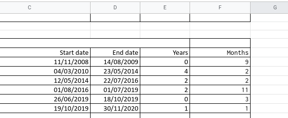

# Sheets

## Date diff



Use the image above as a reference.

### Get year between dates

```text
=DATEDIF(C21;D21; "Y")
```

### Get the months subtracting years

```text
=DATEDIF(C23;D23; "ym")
```

