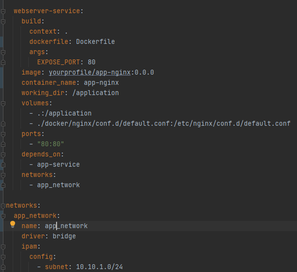

# How to

## Install Docker Community Edition \( DockerCE \)

```text
sudo apt-get install apt-transport-https ca-certificates curl gnupg-agent software-properties-common -y ; \
curl -fsSL https://download.docker.com/linux/ubuntu/gpg | sudo apt-key add -  ; \
sudo add-apt-repository "deb [arch=amd64] https://download.docker.com/linux/ubuntu $(lsb_release -cs) stable" ; \
sudo apt-get install docker-ce docker-ce-cli containerd.io -y ; \
sudo groupadd docker ; \
sudo usermod -aG docker $USER ; \
newgrp docker  ; \
sudo systemctl enable docker ; \
sudo gpasswd -a $USER docker
```

## Uninstall Docker

```text
sudo apt-get remove docker docker-engine docker.io containerd runc
sudo apt-get purge docker-ce docker-ce-cli containerd.io
sudo rm -rf /var/lib/docker
```

## Remove all non-used docker containers

```text
docker system prune
```

## Removing "&lt;none&gt;" images

```text
docker rmi $(docker images -f "dangling=true" -q)
```

## Show real-time logs from the initialized container

```text
docker logs -f container-name
```

## Size of container

```text
docker ps --size
```

## Get running containers 

### Name

```text
docker ps -f status=running --format "{{.Names}}"
```

### JSON

```text
docker ps -f status=running --format "{{json .}}"
```

## Show online/offline containers

```text
#!/bin/sh
list_of_containers="container1 container2container3"
containers=`docker ps -f status=running --format "{{.Names}}"`
for container in $list_of_containers
do
  if echo $containers |grep -q $container
    then  echo "$container online "
  else echo "$container offline"
    #exit 1
  fi
done
exit 0
```

## Create temporary containers

```text
docker run -it --rm --name my-frontend-build -v "$PWD":/home/node/app -w /home/node/app node:13-alpine sh -c "npm run build"
```

## Docker Service Providers DNS

```text
nmcli dev show | grep IP4.DNS
```

## [Set Memory limit](https://www.baeldung.com/ops/docker-memory-limit)

### Memory

For instance, let's limit the memory that the container can use to 512 megabytes. **To constrain memory, we need to use the** _**m**_ **parameter:**

```text
$ docker run -m 512m nginx
```

We can also set a soft limit called a reservation. It's activated when docker detects low memory on the host machine:

```text
$ docker run -m 512m --memory-reservation=256m nginx
```

### CPU

By default, access to the computing power of the host machine is unlimited. **We can set the CPUs limit using the** _**cpus**_ **parameter.** For example, let's constrain our container to use at most two CPUs:

```text
$ docker run --cpus=2 nginx
```

We can also specify the priority of CPU allocation. The default is 1024, higher numbers are higher priority:

```text
$ docker run --cpus=2 --cpu-shares=2000 nginx
```

Similar to the memory reservation, CPU shares play the main role when computing power is scarce and needs to be divided between competing processes.  


### Setting Memory Limit With the docker-compose File

We can achieve similar results using [_docker-compose_](https://www.baeldung.com/docker-compose) files. Mind that the format and possibilities will vary between versions of _docker-compose_.  


#### Versions 3 and Newer With _docker swarm_

Let's give the Nginx service limit of half of CPU and 512 megabytes of memory, and reservation of a quarter of CPU and 128 megabytes of memory. **We need to create “**_**deploy**_**” and then “**_**resources**_**” segments in our service configuration**:

```text
services:
  service:
    image: nginx
    deploy:
        resources:
            limits:
              cpus: 0.50
              memory: 512M
            reservations:
              cpus: 0.25
              memory: 128M
```

**To take advantage of the** _**deploy**_ **segment in a docker-compose file, we need to use the** [_**docker stack**_](https://docs.docker.com/engine/reference/commandline/stack_deploy/) **command.** To deploy a stack to the swarm, we run the _deploy_ command:

```text
$ docker stack deploy --compose-file docker-compose.yml bael_stack
```

#### Version 2 With _docker-compose_

In older versions of _docker-compose,_ we can put resource limits on the same level as the service's main properties. They also have slightly different naming:

```text
service:
  image: nginx
  mem_limit: 512m
  mem_reservation: 128M
  cpus: 0.5
  ports:
    - "80:80"
```

To create configured containers, we need to run the _docker-compose_ command:

```text
$ docker-compose up
```

### Verifying Resources Usage

After we set the limits, we can verify them using the _docker stats_ command:

```text
$ docker stats
CONTAINER ID        NAME                                             CPU %               MEM USAGE / LIMIT   MEM %               NET I/O             BLOCK I/O           PIDS
8ad2f2c17078        bael_stack_service.1.jz2ks49finy61kiq1r12da73k   0.00%               2.578MiB / 512MiB   0.50%               936B / 0B           0B / 0B             2
```

## MACOS 

### Set Bridge IP \(docker bip\)

```text
cd ~/Library/Containers/com.docker.docker/Data/database/com.docker.driver.amd64-linux
echo '{"experimental": false,"debug":"true","bip":"172.18.19.1/24"}' > etc/docker/daemon.js
```

## [How to change the Docker default subnet IP address](https://support.getjoan.com/hc/en-us/articles/360008889859-How-to-change-the-Docker-default-subnet-IP-address)

If the Docker Engine default bridge network is conflicting with your internal network hosts access, you can change the default Docker subnet by following these steps:

1. First, you need to delete your old containers 

   ```text
   sudo docker-compose stop
   ```

2. Next, change the subnet IP inside "/etc/docker/daemon.json", by using this command:

   ```text
   sudo vim /etc/docker/daemon.json
   ```

3. Type in the Netmask IP. With the following structure. Please keep in mind that the IP used here is an example:

   ```text
   {
     "default-address-pools": [
       {"base":"10.10.0.0/16","size":24}
     ]
   }
   ```

4. Restart the Docker Daemon by using this command:

   ```text
   sudo service docker restart
   ```

5. Create a new VSS container and postgres with the following command:

   ```text
   sudo docker-compose up -d
   ```

 And that’s it!

## Docker unable to access from VPN

### Linux

* Check your subnet IP [here](https://vinnyfs89.gitbook.io/knowledge/technology/programming/dev-ops/docker/how-to#how-to-change-the-docker-default-subnet-ip-address) 
* Reset your networks to set correct subnet ip

```text
docker network prune
```

#### Using Docker Compose + OpenVPN

Set the content below inside your docker-compose file:

```text
networks:
  default:
    driver: bridge
    ipam:
      config:
        - subnet: 10.10.1.0/24
```

### Windows

* Set a "default-address-pool"


* Set a subnet network inside the `docker-compose` file



