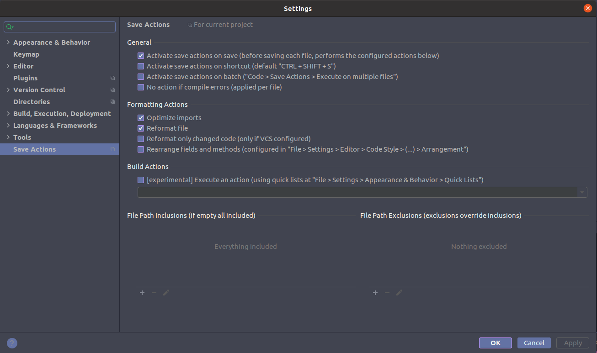

# PHPStorm

## [Install using Jetbrains Toolbox](https://www.jetbrains.com/help/phpstorm/installation-guide.html#toolbox)

* Download the tarball ".tar.gz" from the [Toolbox App web page](https://www.jetbrains.com/toolbox/app/).
* Extract the tarball to a directory that supports file execution.

  For example, if the downloaded version is 1.17.7391, you can extract it to the recommended /opt directory using the following command:

  ```text
  sudo tar -xzf jetbrains-toolbox-1.17.7391.tar.gz -C /opt
  ```

* Execute the "jetbrains-toolbox" binary from the extracted directory to run the Toolbox App and select which product and version you want to install. After you run the Toolbox App for the first time, it will automatically add the Toolbox App icon to the main menu.
* 
* Log in to your JetBrains Account from the Toolbox App and it will automatically activate the available licenses for any IDE that you install.

## Keymap - Clone Caret

* Settings  \(Ctrl + Alt + S\)
* Keymap 
* Find: **`Clone Caret`**
* Define your keymap to Above\(up\) and Below\(down\)

```text
#Example
CTRL + Shift + Alt + Up
CTRL + Shift + Alt + Down
```

[](https://user-images.githubusercontent.com/3949238/42711801-b3f5018e-86bf-11e8-801a-704d7aaa942a.png)

### Another option

Toggle the selection mode to Column:

```text
Shift + Alt + Insert
```

## Free license for student

* Sign in using a free account on [Better Code Hub](https://bettercodehub.com/pricing)

## [Stop indexing node\_modules](https://stackoverflow.com/questions/18514438/ignore-node-modules-in-webstorm-when-using-navigation-pop-up#:~:text=In%20Webstorm%208%2C%20you%20need,will%20then%20work%20as%20before.)

To exclude **node\_modules** folder from all projects \(only created after that change\) you can add this folder to a list of standard folders to ignore.

1. Open PHPStorm, and close current project **File &gt; Close Project**.
2. On startup, PHPStorm window click "**Configure &gt; Settings**". [](https://i.stack.imgur.com/nvKlG.png)
3. Then navigate to **Build, Execution, Deployment &gt; Deployment &gt; Options**.
4. Now you can set node\_modules or anyone else to exclude by default for **all new projects**. [](https://i.stack.imgur.com/RxtXg.png)

P.s. Closing the current project is very important. If you do these settings with an active project, this will affect only the current project.

**References**

* [https://stackoverflow.com/a/38304837/1330323](https://stackoverflow.com/a/38304837/1330323)

## Plugins

### Code formatting on save

* Install the "[**Save Actions**](https://plugins.jetbrains.com/plugin/7642-save-actions)" Plugin for PhpSorm.
* Configure like the image below



### [Gitmoji](https://plugins.jetbrains.com/plugin/10315-gitmoji)


